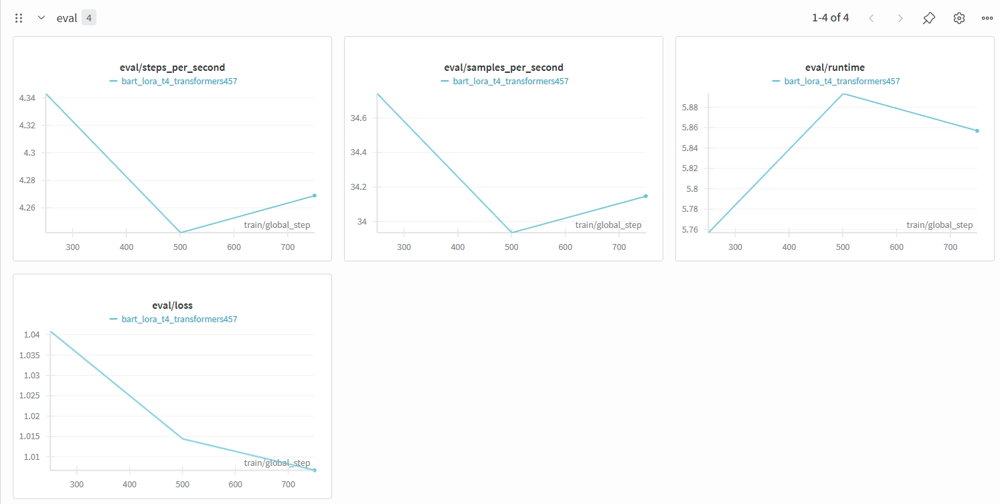
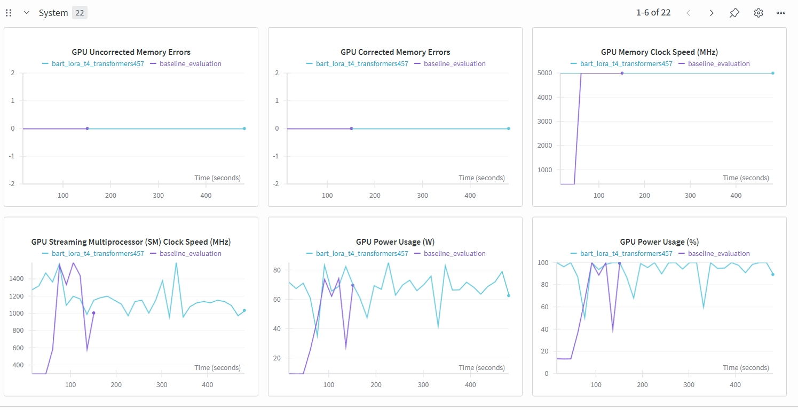

# LLM Engineering & Deployment (LLMED) Certification: Fine-Tuning & Optimization of BART for Dialogue Summarization (HighlightSum)    

This repository contains the full implementation for to the publication **LLMED Certification : LLM Fine-Tuning & Optimization of Bart for Dialogue Summarization (HighlightSum)**, completed as part of the **LLM Engineering and Deployment Certification program** by [Ready Tensor](https://www.readytensor.ai) 

The objective is to **select**, **fine-tune**, **evaluate**, and **deploy** an efficient open-source model for **dialogue summarization**, using a subset of the 
[HighlightSum dataset](https://huggingface.co/datasets/knkarthick/highlightsum). The project includes:  
- model benchmarking and selection  
- LoRA/QLoRA fine-tuning  
- evaluation (ROUGE, BERTScore, BLEU)  
- merging 
- inference and deployment  
- Hugging Face publishing
- reproducible scripts & W&B experiment tracking

---

## Project Overview   

This project builds a complete, reproducible pipeline for fine-tuning open LLMs for conversational summarization:

- **Model benchmarking & selection**  
Comparison of five candidate models ([BART-large](https://huggingface.co/facebook/bart-large-cnn), [T5-large](https://huggingface.co/google/flan-t5-large), [Phi-3-Mini](https://huggingface.co/microsoft/Phi-3-mini-4k-instruct), [LLaMA-1B](https://huggingface.co/meta-llama/Llama-3.2-1B-Instruct), and [LLaMA-3B](https://huggingface.co/meta-llama/Llama-3.2-3B-Instruct)).  
Evaluated on speed + efficiency + ROUGE to determine the best fine-tuning candidate.  

- **LoRA / QLoRA Fine-Tuning**
Efficient parameter-efficient training (PEFT) with LoRA adapters.  
Training uses **2,000 training samples + 200 validation samples** from HighlightSum.

- **Full Evaluation Pipeline**  
ROUGE-1 / ROUGE-2 / ROUGE-L  
BERTScore (semantic similarity)  
BLEU 
Failure category analysis  
Prediction exports (CSV + metrics)  

- **Merging + Final Model**  
Merge LoRA adapters into base BART → produce a **single deployable checkpoint**.

- **Deployment**    
Inference script  
Hugging Face deployment

- **Experiment Tracking**  
All training & evaluation runs logged to [Weights & Biases (W&B)](https://wandb.ai/site).  

---  

## Repository Structure  

```text
📁 C:\Users\Michela\llmed_certification_FineTuneFlow
│
├── train_bart_lora.py                 # LoRA training script (2k samples)
├── baseline_eval.py                   # Baseline BART evaluation (pre-training)
├── eval_bart_lora.py                  # Validation evaluation (ROUGE only)
├── eval_metrics_bart_lora.py          # Extended metrics: ROUGE + BERTScore + BLEU
├── inference_bart_lora.py             # Inference (LoRA)
├── inference_merged.py                # Inference  merged
├── merge_bart_lora.py                 # Merge LoRA -> base BART
├── eval_bart_lora_merged.py           # Validation evaluation merged bart lora
│
├── ft_outputs/
│   ├── bart_lora_highlightsum/        # LoRA adapter checkpoint
│       ├── adapter_model.safetensor
│       ├── adapter_config.json
│       └── tokenizer files
│       └── etc...
│   ├── bart_merged_highlightsum/      # Merged model checkpoint
│       ├── config.json
│       ├── pytorch_model.bin
│       ├── tokenizer.json
│       ├── special_tokens_map.json
│       └── etc...
│
├── metrics/                           # All metrics + prediction CSVs  
│   ├── baseline_predictions.csv
│   ├── baseline_predictions_metrics.csv
│   ├── validation_predictions.csv
│   ├── validation_predictions_metrics.csv
│   ├── validation_predictions_merged.csv
│
├── notebooks/
│   ├── Notebook_C.ipynb               # Model benchmarking & selection
│   ├── Notebook_D.ipynb               # Auto fine-tuning plan generator
│   ├── Notebook_E.ipynb               # Evaluation dashboard (plots, charts)  
│   ├── Notebook_F.ipynb               # Deployment
│  
│
├── outputs/
│   ├── evaluation/                          # Evaluation results generated by Notebook E  
│   │   ├── metrics.json
│   │   ├── metrics.csv
│   │   ├── rouge1.png
│   │   ├── rouge2.png
│   │   ├── rougel.png
│   │
│   ├── benchmarks/
│       ├── notebook_C/                      # Ranking results
│       │   ├── final_ranking.csv
│       │   ├── final_ranking.json
│       │   ├── final_ranking.html
│       ├── notebook_D/                      # Fine-tuning plans, scripts
│       │   ├── finetune_plan.md
│       │   ├── qLoRa_train.sh  MISSING
│       │   ├── train_lora_BART-large_20251202_123700.py
│       │   ├── train_q_lora_LLaMA-1B_20251202_123700.py
│       │   ├── recommendations.json
│       │
│   ├── Screenshopts/
│   ├── graphs_W&B/
├── requirements.txt                   # Project dependencies
└── .env_example.txt                   # Example environment file for API keys
└── .gitignore                         # Ignored files and folders
└── README.md                          # This file (HF Model Card compatible)
├── Model_Card_merged.md               # Full model card for HF Hub
```
---

## LLMED Fine-Tuning & Deployment Workflow  
The complete pipeline including training → evaluation → merging → deployment   
is diplayed in the following workflow (end-to-end):  

```
┌─────────────────────────────────────────────────────────────────────────────┐
│ 1. DATASET PREPARATION — HighlightSum                                       │
│                                                                             │
│   • Load HighlightSum from HuggingFace                                      │
│   • Select subset: 2,000 train / 200 validation                             │
│   • Inspect text length and sample quality                                  │
│   • No additional preprocessing required                                    │
│                                                                             │
│   Output: ./data/highlightsum_dataset (subset, ready for training)          │
└─────────────────────────────────────────────────────────────────────────────┘
                                      │
                                      ▼
┌─────────────────────────────────────────────────────────────────────────────┐
│ 2. MODEL BENCHMARKING (Notebook C)                                          │
│                                                                             │
│   • Compare: BART-large, T5-large, Phi-3-Mini, LLaMA-1B, LLaMA-3B           │
│   • Compute: ROUGE-1/2/L · Throughput · Efficiency Score                    │
│   • Produces: final_ranking.csv                                             │
│                                                                             │
│   Output Dir: ./outputs/benchmarks/notebook_C                               │
└─────────────────────────────────────────────────────────────────────────────┘
                                      │
                                      ▼
┌─────────────────────────────────────────────────────────────────────────────┐
│ 3. AUTO FINE-TUNING PLAN (Notebook D)                                       │
│                                                                             │
│   • Reads: final_ranking.csv                                                │
│   • Generates fine-tuning recommendations per model                         │
│   • Exports:                                                                │
│       – finetune_plan.md                                                    │
│       – recommendations.json                                                │
│       – train_qLoRA.py (template)                                           │
│       – qLoRA_train.sh (Accelerate launcher)                                │
│                                                                             │
│   Output Dir: ./outputs/benchmarks/notebook_D                               │
└─────────────────────────────────────────────────────────────────────────────┘
                                      │
                                      ▼
┌─────────────────────────────────────────────────────────────────────────────┐
│ 4. BASELINE EVALUATION (Before Training)                                    │
│                                                                             │
│   Run:                                                                      │
│     python baseline_eval.py                                                 │
│                                                                             │
│   Outputs:                                                                  │
│     • baseline_predictions.csv                                              │
│     • ROUGE baseline                                                        │
│     • BERTScore baseline                                                    │
│     • BLEU baseline                                                         │
│                                                                             │
│   Purpose: Verify performance before fine-tuning                            │
└─────────────────────────────────────────────────────────────────────────────┘
                                      │
                                      ▼
┌─────────────────────────────────────────────────────────────────────────────┐
│ 5. FINE-TUNING WITH LoRA                                                    │
│                                                                             │
│   Run:                                                                      │
│     python train_bart_lora.py                                               │
│                                                                             │
│   Training Features:                                                        │
│     • LoRA (r=8, α=32, dropout=0.05)                                        │
│     • Effective batch size = 8 (4 × 2 accumulation)                         │
│     • fp16 training on T4 GPU                                               │
│     • W&B tracking enabled                                                  │
│                                                                             │
│   Output Folder:                                                            │
│     ft_outputs/bart_lora_highlightsum/                                      │
└─────────────────────────────────────────────────────────────────────────────┘
                                      │
                                      ▼
┌─────────────────────────────────────────────────────────────────────────────┐
│ 6. EVALUATION OF LoRA MODEL                                                 │
│                                                                             │
│   ROUGE-level scoring:                                                      │
│     python eval_bart_lora.py                                                │
│                                                                             │
│   Extended metrics (ROUGE + BERTScore + BLEU):                              │
│     python eval_metrics_bart_lora.py                                        │
│                                                                             │
│   Outputs:                                                                  │
│     • metrics/validation_predictions.csv                                    │
│     • metrics/validation_predictions_metrics.csv                            │
└─────────────────────────────────────────────────────────────────────────────┘
                                      │
                                      ▼
┌─────────────────────────────────────────────────────────────────────────────┐
│ 7. MERGE LoRA → BASE BART                                                   │
│                                                                             │
│   Run:                                                                      │
│     python merge_bart_lora.py                                               │
│                                                                             │
│   Output Folder:                                                            │
│     ft_outputs/bart_merged_highlightsum/                                    │
│                                                                             │
│   Notes: Deployment-ready model                                             │
└─────────────────────────────────────────────────────────────────────────────┘
                                      │
                                      ▼
┌─────────────────────────────────────────────────────────────────────────────┐
│ 8. EVALUATION OF MERGED MODEL                                               │
│                                                                             │
│   Run:                                                                      │
│     python eval_bart_lora.py --model=merged_clean                           │
│                                                                             │
│   Compare Metrics:                                                          │
│     • pre-merge LoRA metrics vs merged model metrics                        │
│     • ROUGE, BERTScore, BLEU                                                │
│                                                                             │
│   Outputs:                                                                  │
│     • metrics/merged_eval.json                                              │
│     • validation_predictions_merged.csv                                   │
│                                                                             │
│   Purpose: Verify merging preserves model quality                           │
└─────────────────────────────────────────────────────────────────────────────┘
                                      │
                                      ▼
┌─────────────────────────────────────────────────────────────────────────────┐
│ 9. EVALUATION DASHBOARD (Notebook E)                                        │
│                                                                             │
│   Models Compared:                                                          │
│     • Baseline BART (no training)                                           │
│     • BART + LoRA fine-tuned                                                │
│     • BART merged (LoRA merged into base)                                   │
│                                                                             │
│   Computes:                                                                 │
│     • ROUGE-1 / ROUGE-2 / ROUGE-L                                           │
│     • BLEU                                                                  │
│     • BERTScore-F1                                                          │
│                                                                             │
│   Saves:                                                                    │
│     • Per-model CSVs                                                        │
│     • Summary comparison table                                              │
│     • Charts for each metric                                                │
└─────────────────────────────────────────────────────────────────────────────┘
                                      │
                                      ▼
┌─────────────────────────────────────────────────────────────────────────────┐
│ 10. DEPLOYMENT & INFERENCE   (Notebook E)                                   │
│                                                                             │
│   Inference script:                                                         │
│     python inference_bart_lora.py                                           │
│                                                                             │
│   Supports:                                                                 │
│     • LoRA adapter mode                                                     │
│     • Fully merged model mode                                               │
│                                                                             │
│   Deployment options:                                                       │
│     • FastAPI inference server                                              │
│     • Gradio Web UI                                                         │
│     • Hugging Face Space                                                    │
│                                                                             │
│   Output: Production-ready model + API                                      │
└─────────────────────────────────────────────────────────────────────────────┘

=============================================
               METRICS FLOW
Baseline → LoRA fine-tuned → Merged → Dashboard → Deployment
=============================================
```

---

## Metrics Provided    
Each evaluation includes the metrics diplayed in the above table:  
| Metric                          | Purpose                                         |
| ------------------------------- | ----------------------------------------------- |
| **ROUGE-1 / ROUGE-2 / ROUGE-L** | Lexical overlap with human summaries            |
| **BERTScore (F1)**              | Meaning-based semantic similarity               |
| **BLEU**                        | N-gram precision similarity                                |
| **Avg. summary length**         | Output consistency check                        |
| **Full prediction CSV**         | For manual inspection                           |
| **Failure case examples**       | Over-/under-summarization, hallucinations, etc. |

>_Note_: validation_predictions.csv include | id | source_text | reference_summary | generated_summary | rougeL_score |

---

## Key Comparisons  
| Comparison                                | Purpose                                    |    Question                          |
| ----------------------------------------- | -------------------------------------------|--------------------------------------|
| **Baseline BART vs LoRA-fine-tuned BART** | Measure fine-tuning impact                 | Is LoRA training effective?          |
| **LoRA vs Merged model**                  | Check whether merge preserved weights      | Is merging lossless?                 |
| **Merged model inference**                | Final deployment quality                   |  Is the final model production-ready?|

>_Note_: This follows the pipeline: Fine-tune → evaluate → merge → cleanup → evaluate → deploy

---  

## Deployment Options    
Hugging Face Hub : Includes full model card + checkpoint upload script.

---   

## Batch inference deployment  
For large-scale summarization workflows.

--- 

## Weights & Biases Integration
All scripts support:  
- training loss curves  
- evaluation metrics  
- full prediction tables  
- sample predictions  
- hyperparameter logging  

--- 

## Getting Started  
This section shows how to install dependencies, configure authentication, and run the full pipeline.  

### Prerequisites  
_Required_:
- Python 3.10+    
- [HuggingFace Account & API Key](https://huggingface.co/)
- GPU environment (Colab T4, L4, A100, or local RTX)
    
_Recommended_:   
- [Weights & Biases Account](https://wandb.ai/site) (for experiment tracking—optional, but recommended)

_Set relevant API keys in your environment_:  
```bash
export HF_API_KEY=your_huggingface_key
export WANDB_API_KEY=your_wandb_key
```
### Authentication for Notebooks (Colab/Jupyter)
**Hugging Face Login**
```python
from huggingface_hub import notebook_login
notebook_login()
```
**Weights & Biases Login**  
```
pip install wandb
wandb login
```

### Installation

```bash
git clone https://github.com/micag2025/llmed_certification_FineTuneFlow.git
cd llmed_certification_FineTuneFlow
pip install -r requirements.txt
```
---

## Running the Pipeline

### 1 Dataset Selection and Preparation  
- Dataset: Highlightsum dataset  
  - Consists of conversational transcripts  
  - Targets are highlight-style summaries (short bullet-like summaries)        
- Sample used:  
  - 2,000 for training    
  - 200 for validation  

_Recommended Training Subset Sizes (HighlightSum)_
| Subset Size      | GPU Time (T4) | Expected Quality | Notes                                      |
| ---------------- | ------------- | ---------------- | ------------------------------------------ |
| **1k**           | 22–30 min     | Medium           | Good for debugging                         |
| **2k**           | 40–55 min     | Good             | **Recommended baseline** (current project) |
| **5k**           | 2–3 hours     | Very good        | Best overall trade-off                     |
| **Full dataset** | 10–14 hours   | Excellent        | Requires A100; certification-grade         |

> _Note_ This project fine-tunes BART-large with LoRA using a subset of 2,000 training samples and 200 validation samples from the HighlightSum dataset because this configuration provides the best  
 balance of training speed, GPU cost, and summarization quality on a Colab T4 environment.

- Preprocessing Includes:  
  - Tokenization (BART tokenizer)
  - Input truncation: 768 tokens
  - Target truncation: 192 tokens
  - Padding to longest sequence
  - Text formatting for summarization tasks
      
This project focuses on model evaluation + fine-tuning – not data cleaning.  

**Screenshot Inspection Dataset**

```
 📊 Dataset Overview:
  Train splits: 27,401 samples
  Val splits: 1,360 samples
  Test splits: 2,347 samples`

🔑 Keys: ['id', 'dialogue', 'summary']

📘 First training example:

🔸 DIALOGUE (32390 chars):
Speaker A: Cool. Do you wanna give me the little cable thing? Yeah. Cool. Ah, that's why it won't meet. Okay, cool. Yep, cool. Okay, functional requirements. Alright, yeah. It's working. Cool, okay. So what I have, wh where I've got my information from is a survey where the usability lab um observed...

🔹 SUMMARY (1299 chars):
The project manager opens the meeting by stating that they will address functional design and then going over the agenda. The industrial designer gives his presentation, explaining how remote controls function and giving personal preference to a clear, simple design that upgrades the technology as well as incorporates the latest features in chip design. The interface specialist gives her presentation next, addressing the main purpose of a remote control. She pinpoints the main functions of on/off, channel-switching, numbers for choosing particular channels, and volume; and also suggests adding a menu button to change settings such as brightness on the screen. She gives preference to a remote that is small, easy to use, and follows some conventions. The group briefly discusses the possibility of using an LCD screen if cost allows it, since it is fancy and fashionable. The marketing expert presents, giving statistical information from a survey of 100 subjects. She prefers a remote that is sleek, stylish, sophisticated, cool, beautiful, functional, solar-powered, has long battery life, and has a locator. They discuss the target group, deciding it should be 15-35 year olds. After they talk about features they might include, the project manager closes the meeting by allocating tasks.  
```


### 2 Model Benchmarking (Notebook C) 
Notebook `notebook_C.ipynb` evaluates: 
- BART-large  
- T5-large  
- Phi-3-Mini  
- LLaMA-1B  
- LLaMA-3B  
**Metrics computed**  
- ROUGE-1 / ROUGE-2 / ROUGE-L  
- Throughput (tokens/s)  
- Latency per sample  
- Composite efficiency score  
**Tokenizer safety rules**    
- Set pad_token = eos_token when needed  
- Truncate to max_length = 768  
- Use padding="longest" for seq2seq  
- Use padding="max_length" for causal models  
- Batch inputs to reduce GPU RAM usage  

**Outputs**
```
model_benchmarks/notebook_C/final_ranking.csv
model_benchmarks/notebook_C/final_ranking.json
model_benchmarks/notebook_C/final_ranking.html
```

**Benchmark Results**

| model       | model_id                                       |    rouge1 |    rouge2 |    rougeL |        time | throughput |  efficiency | composite_score |
|-------------|------------------------------------------------|----------:|----------:|----------:|------------:|------------:|------------:|-----------------:|
| BART-large  | facebook/bart-large-cnn                        |  28.106   |   9.183   |  21.063   |   101.632   |    1.968    |    0.207    |      1.231      |
| LLaMA-1B    | meta-llama/Llama-3.2-1B-Instruct               |  28.636   |   9.618   |  21.205   |   393.929   |    0.508    |    0.054    |      0.463      |
| LLaMA-3B    | meta-llama/Llama-3.2-3B-Instruct               |  23.772   |   8.223   |  17.306   |   748.223   |    0.267    |    0.023    |     -0.162      |
| Phi-3-Mini  | microsoft/Phi-3-mini-4k-instruct               |  20.550   |   7.028   |  14.307   |   987.636   |    0.203    |    0.014    |     -0.572      |
| T5-large    | t5-large                                       |  10.977   |   1.944   |   9.637   |   263.028   |    0.760    |    0.037    |     -0.960      |

> _Notes_:  Accuracy (ROUGE-L is used as the primary accuracy metric), Latency (Time refers to the average inference time per sample), Throughput (samples/sec = speed=total time),
            Efficiency (Defined as ROUGE-L divided by inference time = ROUGE/time), Composite score (Normalized metric combining accuracy and efficiency to support model selection).


The above Ranking Benchmark Table provides a full benchmarking and model-selection pipeline. Thus, this identifies automatically the best model to fine-tune based on balanced performance rather than size alone. To sum up, the highest composite_score wins. When selecting models for dialogue summarization, balancing prediction quality with inference efficiency is crucial — especially in practical or real-time settings.  

_Key takeaways_  
  - Composite score reflects both accuracy and speed, giving a more holistic evaluation than ROUGE alone.    
  - Models like BART-large outperform others because they achieve solid accuracy and fast inference.    
  - Larger causal models (e.g., LLaMA-3B, Phi-3-Mini) may achieve acceptable ROUGE scores, but their high latency significantly reduces their overall ranking.   

This shows the importance of balancing accuracy with inference speed when benchmarking large models for dialogue summarization.    


### 3 Auto Fine-Tuning Recommendation & Plan Results  (Notebook D)   
Notebook `notebook_D.ipynb` generates:    
- _finetune_plan.md_ — human-readable training plan
- _recommendations.json_ — hyperparameter recommendations
- _train_qLoRA.py_ — template script
- _qLoRA_train.sh_ — Accelerate launcher  

Notebook D generates `recommendations.json`, which contains per-model fine-tuning strategies and hyperparameters. Based on this analysis, BART-large and LLaMA-1B emerged as the top two candidates.  

**Recommendation Output**
```json
{
  "BART-large": {
    "size_hint": "0.4B",
    "method": "LoRA (PEFT) \u2014 encoder\u2013decoder friendly",
    "recommended_hyperparams": {
      "epochs": 3,
      "micro_batch_size": 8,
      "lr": 0.0002
    }
  },
  "LLaMA-1B": {
    "size_hint": "1B",
    "method": "LoRA or full fine-tune",
    "recommended_hyperparams": {
      "epochs": 3,
      "micro_batch_size": 8,
      "lr": 0.0002
    }
  }
```

**Interpretation & Comparison**

| Model          | Size | Recommended PEFT Method                    | Suggested Hypers                   | Meaning                                                   |
| -------------- | ---- | ------------------------------------------ | ---------------------------------- | --------------------------------------------------------- |
| **BART-large** | 0.4B | **LoRA (PEFT) — encoder–decoder friendly** | epochs: 3, batch size: 8, LR: 2e-4 | **Best match for abstractive summarisation + efficiency** |
| **LLaMA-1B**   | 1B   | LoRA **or full fine-tune**                 | epochs: 3, batch size: 8, LR: 2e-4 | Strong, but slower + worse summarisation on highlightSUM  |

**BART-large** for fine-tuning was selected and it is the preferred choice because:  
- Highest composite score from Notebook D rankings  
- Optimized architecture for encoder-decoder summarization tasks (HighlightSUM)  
- Native LoRA support on attention projections (q_proj/v_proj) without special patching  
- Efficient training & inference on Colab T4 GPU  

Briefly, while both models received identical hyperparameters, BART-large offers superior performance due to its architecture fit, ROUGE scores, and latency characteristics.  


### 4 Baseline Evaluation (BART-large CNN)  
Run 
```
python llmed_certification_FineTuneFlow/baseline_eval.py 
```

**Baseline Metrics**

| Metric           | Score |
| ---------------- | ----- |
| **ROUGE-1**      | 0.275 |
| **ROUGE-2**      | 0.090 |
| **ROUGE-L**      | 0.203 |
| **BERTScore-F1** | 0.163 |
| **BLEU**         | 0.005 |

> _Notes_: Baseline struggles: missing context compression, often overly generic summaries.    


### 5 Fine-Tuning (`train_bart_lora.py`)  
Next steps:  
- customize the `train_qLoRA.py` to the chosen model (map tokenizers/prompt style precisely). 
- add validation loop + ROUGE evaluation inside training to checkpoint best model.
- produce a small sample dataset JSONL generator from SAMSum that matches the expected supervised format.
- estimate training time more accurately based on the GPU type (T4 / L4 / A100) and hours you can run.  

After customize `train_qLoRA.py`, the script to be considered is `train_bart_lora.py`
Run LoRA fine-tuning:
```
python llmed_certification_FineTuneFlow/train_bart_lora.py
```
**Features**:
- Optimized for T4 GPUs  
- Effective batch size = 8  
- LoRA r=8, α=32  
- fp16 training  
- use_cache=False for stability  
- W&B logging built-in

**Output**:  
```
ft_outputs/bart_lora_highlightsum/
```

**Example of `customization of train_qLoRA.py`**  

 ```bash
  # -------------------------
# Config
# -------------------------
MODEL_NAME = "facebook/bart-large-cnn"
OUTPUT_DIR = "/content/llmed_certification_FineTuneFlow/ft_outputs/bart_lora_highlightsum"

TRAIN_SAMPLES = 2000
VAL_SAMPLES = 200

EPOCHS = 3
MICRO_BATCH_SIZE = 4
GRAD_ACC = 2   # effective batch size = 8
LEARNING_RATE = 2e-4
MAX_INPUT_LENGTH = 768
MAX_TARGET_LENGTH = 192
WANDB_PROJECT = "highlightsum_bart_lora"
os.makedirs(OUTPUT_DIR, exist_ok=True)
device = "cuda" if torch.cuda.is_available() else "cpu"
print(f"🔥 Using device: {device}")
```    

**Screeshot output train.py** 

- **Model Loaded in 4-bit Successfully**
  


- **QLoRA Training Started**
```bash
 🚀 Starting QLoRA training…
`use_cache=True` is incompatible with gradient checkpointing. Setting `use_cache=False`.
```
> _Note_: This is normal. It actually reduces memory usage, which is good.

- **Completion**  
```bash  
💾 Saving LoRA adapters…  
🎉 Training completed. Saved to bart_lora_highlightsum
```    

### 6 Evaluation (Before Merge)  
Basic evaluation:

```
python llmed_certification_FineTuneFlow/eval_bart_lora.py
```
Full Metrics:  
```
python llmed_certification_FineTuneFlow/eval_metrics_bart_lora.py
```
Outputs:
```
metrics/validation_predictions.csv
metrics/validation_predictions_metrics.csv
```
Metrics include:
ROUGE-1 / ROUGE-2 / ROUGE-L
BERTScore (semantic similarity)
BLEU score
Per-sample predictions

**LoRA Metrics (Validation)**

| Metric           | Score |
| ---------------- | ----- |
| **ROUGE-1**      | 0.337 |
| **ROUGE-2**      | 0.151 |
| **ROUGE-L**      | 0.252 |
| **BERTScore-F1** | 0.298 |
| **BLEU**         | 0.011 |

> _Notes_: Huge improvement across all metrics vs baseline.


### 7 Merge LoRA → Base Model/Merge LoRA Into BART

Merge adapters:
```
python llmed_certification_FineTuneFlow/merge_bart_lora.py
```

What the script does:  
- Loads base model in FP16  
- Loads LoRA adapters  
- Applies LoRA weights  
- Writes a standalone merged checkpoint  

Output:  
```
ft_outputs/bart_merged_highlightsum/
```

### 8 Final Evaluation (Merged Model)
```
python llmed_certification_FineTuneFlow/eval_bart_lora.py --model=merged
```
Or full metrics:  
```
python llmed_certification_FineTuneFlow/eval_metrics_bart_lora.py
```
Used to confirm that merging preserves LoRA improvements.  

**Merged Model Metrics**

| Metric           | Score |
| ---------------- | ----- |
| **ROUGE-1**      | 0.383 |
| **ROUGE-2**      | 0.179 |
| **ROUGE-L**      | 0.300 |
| **BERTScore-F1** | 0.334 |
| **BLEU**         | 0.001 |

_Interpretation_  
- BART merged > LoRA > Baseline  
- Best BERTScore
- Highest ROUGE
- BLEU drops (expected for free-form summarization)

**Model Comparison Base BART (optional baseline), LoRA-adapted BART and  Merged FP16 BART**
From the model comparison based on the evaluation metrics, it has been verified whether; 
- Did LoRA training improve performance?
- Does merging preserve performance?
- Is the model ready for deployment?

 _Overview Based on Evaluation Metrics_
| Model                 | ROUGE-1 | ROUGE-2 | ROUGE-L | BERTScore-F1 | BLEU   |
| --------------------- | ------- | ------- | ------- | ------------ | ------ |
| **Baseline BART**     | 0.275   | 0.090   | 0.203   | 0.163        | 0.0051 |
| **LoRA (Fine-Tuned)** | 0.337   | 0.151   | 0.252   | 0.298        | 0.0111 |
| **Merged Model**      | 0.383   | 0.179   | 0.300   | 0.334        | 0.0013 |

Key Findings
1. Fine-tuning with LoRA provides a major improvement over the baseline model  
Across all meaningful metrics:  
ROUGE-1 improves by +22%  
ROUGE-2 improves by +68%  
ROUGE-L improves by +24%  
BERTScore-F1 jumps by +83%  

This indicates substantially better content coverage, coherence, and semantic fidelity after LoRA fine-tuning.

2. The merged model outperforms the LoRA model on all major metrics

Compared to the LoRA adapters:
| Metric           | Improvement (Merged vs LoRA) |
| ---------------- | ---------------------------- |
| **ROUGE-1**      | +13.6%                       |
| **ROUGE-2**      | +18.2%                       |
| **ROUGE-L**      | +19.2%                       |
| **BERTScore-F1** | +12.2%                       |

This confirms that LoRA merging was successful and did not degrade performance—on the contrary, merging led to further gains, likely due to:
- fused layers improving inference stability   
- eliminating adapter switching  
- fewer numerical precision issues

3. BLEU is misleading here — ignore it  
BLEU drops in the merged model, but this is not a negative signal due to several reasons, such as:   
- Dialogue summarization involves paraphrasing  
- BLEU unfairly penalizes paraphrases (word-based n-grams)  
- ROUGE and BERTScore are the correct metrics for summarization  

All ROUGE and BERTScore metrics show strong improvement, so BLEU can safely be disregarded.

_Overall Conclusion (Recommended for Model Card)_  
Fine-tuning BART with LoRA yields significant improvements in summarization quality, nearly doubling semantic fidelity (BERTScore) compared to the baseline.
The merged model performs best, achieving the highest ROUGE-1/2/L and BERTScore among all variants. This indicates that merging LoRA adapters into the base model:
preserves all learned improvements may enhance layer interaction produces a more stable, higher-quality final model

The merged model should be used for deployment and inference.


### 9 Inference & Deployment Hugging Face Hub  
Run inference locally:  
```
python llmed_certification_FineTuneFlow/inference_merged.py  
```

To publish the merged BART model to HuggingFace, the final, production-ready publishing script (`Notebook_F` equivalent) allows to upload the trained model reliably. This includes **full model card** and checkpoint upload script.  See [HF_model on Hugging Face](https://huggingface.co/dlaima/bart-highlightsum-merged).    

#### Model Card (Hugging Face Summary)  
**Model**: bart-large-cnn fine-tuned with LoRA on HighlightSum  
**Task**: Dialogue Summarization  
**Training Samples**: 2,000  
**Validation Samples**: 200  
**Method**: LoRA (r=8, α=32)  
**Metrics**: ROUGE, BERTScore, BLEU  
**Intended Use**: Conversational summarization (multi-turn dialog)  
**Limitations**: May miss fine-grained details, not domain-specialized  
**License**: MIT (inherits from BART)  
> _Note_ For more information see [Model_Card](https://github.com/micag2025/llmed_certification_FineTuneFlow/blob/6c4b9058581f14ea2d6bd979b30ff7bfa7afb94d/Model_Card_merged.md) 

**Screenshot HuggingFace model interface**  

 


###  Experiment Tracking with Weights & Biases (W&B)  
Training runs are instrumented and tracked using [Weights & Biases](https://wandb.ai/site). This integration enables:
- Visualization of training loss and evaluation curves
- Learning rate schedule and gradient monitoring
- GPU memory usage tracking during training
- Evaluation metrics logging after each epoch
- Model artifact saving and versioning

All W&B integration is handled in the training script [`run_llama_qlora.py`](run_llama_qlora.py) with minimal and safe changes:
- Added `wandb.init(...)` for project setup
- Configured `report_to="wandb"` and custom `run_name`
- Enabled configuration tracking for reproducibility

#### Example Visualizations


   

   

**Usage Note**: All tracking features are enabled only during training within the notebook/script.

---

**Want to view your training run?**
Once W&B is installed and you are logged in, your training run will automatically appear at:
```
https://wandb.ai/<your-team-or-user>/llama-qlora-samsum
```
- Loss curves: automatically logged  
- Eval metrics: automatically logged  
- Model artifacts: saved & versioned  
- GPU utilization: tracked
  
---

## Example Usage                                                                 

### Summarize new dialogues with the merged fine-tuned model  

```bash
from transformers import AutoTokenizer, AutoModelForSeq2SeqLM
import torch

model_name = "dlaima/bart-highlightsum-merged"

tokenizer = AutoTokenizer.from_pretrained(model_name)
model = AutoModelForSeq2SeqLM.from_pretrained(model_name)

text = """A: Hi Tom, are you busy tomorrow afternoon?
B: I think I am. Why?
A: I want to go to the animal shelter.
B: For what?
A: I'm getting a puppy for my son."""

inputs = tokenizer(text, return_tensors="pt", truncation=True, max_length=1024)
summary = model.generate(**inputs, max_new_tokens=192)
print(tokenizer.decode(summary[0], skip_special_tokens=True))
```
output
```
Tom and A want to go to the animal shelter tomorrow afternoon. A wants to get a puppy for her son.
```

## Technologies Used

- [Hugging Face Transformers](https://huggingface.co/)
- [PEFT (LoRA/QLoRA)](https://github.com/huggingface/peft)
- [Weights & Biases](https://wandb.ai/site)
- [bitsandbytes](https://github.com/TimDettmers/bitsandbytes) (quantization)  
- Python, Colab/Jupyter

---

## Limitations & Recommendations

- **Dataset Coverage & Domain Shift**      
  - _Limitation_: The HighlightSum dataset mainly contains structured, turn-based dialogues.    
  - _Recommendation_: Apply domain-specific fine-tuning if your data differs significantly. Consider adding 5–10% in-domain samples for mixed fine-tuning.    
- **Limited Long-Context Support (BART limitation)**   
  - _Limitation_: BART-large has a hard max input length of 1024 tokens. The training uses max_length=768 for speed on T4.    
  - _Recommendation_: Pre-chunk long transcripts into semantic segments (speaker turns, topic segments). Summarize each chunk → then summarize summaries (“recursive summarization”). If long-context is critical, consider exporting the pipeline to a LLaMA 3.1/3.2 8B model with LoRA.    
- **PEFT/LoRA Adapters Cannot Fix All Model Weaknesses**   
  - _Limitations_: LoRA fine-tuning only trains a small set of low-rank adapter weights.  
  - _Recommendation_: If summaries must follow a strict structure, consider adding: instruction-prefix templates, or task-specific prompting or control tokens (e.g., length control, style control)  
- **T4 GPU Compute Constraints**   
  - _Limitation_: T4 has limited VRAM (16 GB), relatively low tensor-core throughput, slow 4-bit dequantization, slow 4-bit dequantization  
  - _Recommendation_: Keep max_length ≤ 768 for training,  Use gradient accumulation rather than larger batch sizes. Prefer LoRA r=8 for stability. For heavy workloads, consider: A100 or L4  
- **Summaries May Become Too “Generic”**  
  - _Limitations_: BART tends to: compress aggressively omit nuance produce safe but generic summaries. Especially if dialogue contains ambiguous or multi-topic content.  
  - _Recommendation_: Add style-conditioned training samples ("bullet points", "2-line summary").    

---
 
## License

This project is licensed under the MIT License. See the [LICENSE](https://github.com/micag2025/llmed_certification_FineTuneFlow/blob/635810bf5156df647e9733c290e45a20760d04e7/LICENSE) file for details.

---

## Contact

If you encounter bugs, have questions, or want to request a new feature, please [open an issue](https://github.com/micag2025/llmed_certification_FineTuneFlow/pulls) on this repository.   


