# LLM Engineering and Deployment (LLMED) Certification:Capstone Project: LLM Fine-Tuning & Optimization for Dialogue Summarization (HighlightSum)

This repository is part of capstone project for the **LLM Engineering and Deployment Certification program** by [Ready Tensor](https://www.readytensor.ai) and it is linked to the publication:**LLMED Certification:Capstone Project:LLM Fine-Tuning & Optimization for Dialogue Summarization (HighlightSum)** available on [Ready Tensor](https://www.readytensor.ai). This project builds a complete evaluation, selection, and fine-tuning pipeline for small-to-medium open-source language models. The objective is to identify the most efficient model for dialogue summarization, then fine-tune it using QLoRA and optimize it for real-world deployment. This was achieved using a subset of the HighlightSum dataset. This capstone project focuses on fine-tuning and benchmarking large language models for efficient, high-quality conversational summarization.

---

## Project Overview (Description)

This project develops a scalable, efficient workflow for selecting, fine-tuning, and evaluating open-source LLMs (e.g. BART, T5, LLaMA-1B, LLaMA-3B, Phi-3-Mini) for the task of dialogue summarization, using a subset of the benchmark [HighlightSum dataset](https://huggingface.co/datasets/knkarthick/highlightsum) as a test dataset. The codebase automates model selection via benchmarking, applies QLoRA for parameter-efficient fine-tuning, and outputs deployable artifacts.

---

## Workflow & Stages for BART-LoRA Fine-Tuning    

>_Option1_ 

```text  

┌────────────────────────────────────────────────────┐
│ 1. Prepare Dataset  HighlightSum                               │
│  ─ Raw documents                                    │
│  ─ Highlights / summaries                           │
│  → Format into HuggingFace dataset (train/val)      │
└────────────────────────────────────────────────────┘
                         │
                         ▼
┌────────────────────────────────────────────────────┐
│ 2. Fine-Tune Base BART with LoRA (PEFT)             │
│  python train_bart_lora.py                          │
│  Output: ./ft_outputs/bart_lora                     │
│   (LoRA adapter weights + training logs)            │
└────────────────────────────────────────────────────┘
                         │
                         ▼
┌────────────────────────────────────────────────────┐
│ 3. Evaluate LoRA Model (Validation)                 │
│  python eval_bart_lora.py                           │
│  Output: ./metrics/lora_eval.json                   │
│    - ROUGE-1 / ROUGE-2 / ROUGE-L                    │
│    - BERTScore, BLEU                                │
│    - validation_predictions.csv                     │
└────────────────────────────────────────────────────┘
                         │
                         ▼
┌────────────────────────────────────────────────────┐
│ 4. Merge LoRA into Base BART                        │
│  python merge_lora.py                               │
│  Output: ./ft_outputs/bart_merged                   │
└────────────────────────────────────────────────────┘
                         │
                         ▼
┌────────────────────────────────────────────────────┐
│ 5. Post-Merge Cleanup (Fix Config)                  │
│  python post_merge_cleanup.py                       │
│  Fixes:                                             │
│   - forced_bos_token_id                             │
│   - decoder_start_token_id                          │
│   - early_stopping flag                             │
│  Output: ./ft_outputs/bart_merged_clean             │
└────────────────────────────────────────────────────┘
                         │
                         ▼
┌────────────────────────────────────────────────────┐
│ 6. Evaluate Final Merged Model                      │
│  python eval_bart_lora.py --model=merged_clean      │
│  Output: ./metrics/merged_eval.json                 │
│                                                      │
│  🔽 Comparison (automatic in notebook)               │
│    lora_eval.json       vs       merged_eval.json    │
│    → Does merging preserve or improve ROUGE?         │
└────────────────────────────────────────────────────┘
                         │
                         ▼
┌────────────────────────────────────────────────────┐
│ 7. Inference / Deployment                           │
│  python test_inference.py                           │
│  or deploy using:                                   │
│   - FastAPI Endpoint                                │
│   - Gradio Web UI                                   │
│   - Hugging Face Space                              │
│   - LangChain Tool                                  │
└────────────────────────────────────────────────────┘

```

The complete and up-to-date pipeline / workflow (end-to-end) including training → evaluation → merging → deployment → export.


> Option2
```text
─────────────────────────────────────────────────────────────
 📂 1. DATA & PREP
─────────────────────────────────────────────────────────────
   dataset/ → your JSON or HF dataset
        │
        └── preprocess (optional filtering / sampling)
             ↓
   train.json , validation.json
─────────────────────────────────────────────────────────────
 🧠 2. TRAINING (LoRA adaptation)
─────────────────────────────────────────────────────────────
   train_bart_lora.py
        ↓
   ./ft_outputs/bart_lora_highlightsum  ← LoRA adapter weights
   (PEFT checkpoints + base model refs only)
─────────────────────────────────────────────────────────────
 📊 3. PRE-MERGE EVALUATION (Optional — on LoRA model)
─────────────────────────────────────────────────────────────
   eval_bart_lora_before_merge.py
        ↓
   rouge_before.json / metrics_before.png
   validation_predictions_before.csv
─────────────────────────────────────────────────────────────
 🔗 4. MERGE LoRA WEIGHTS INTO FULL BART MODEL
─────────────────────────────────────────────────────────────
   merge_lora.py
        ↓
   ./ft_outputs/bart_merged_highlightsum   ← Full FP16 HF model
─────────────────────────────────────────────────────────────
 🧹 5. POST-MERGE CLEANUP (fix generation config)
─────────────────────────────────────────────────────────────
   post_merge_cleanup.py
        ↓
   ./ft_outputs/bart_merged_clean   ← FINAL PRODUCTION MODEL
─────────────────────────────────────────────────────────────
 🚦 6. POST-MERGE USAGE  (deployment stage)
─────────────────────────────────────────────────────────────
                   ./ft_outputs/bart_merged_clean
                                │
          ┌─────────────────────┼─────────────────────┐
          ▼                     ▼                     ▼
   inference.py          evaluate.py           Notebook-F (GGUF export)
(Real use / API)   (ROUGE + BERTScore + BLEU     for llama.cpp /
                       + charts dashboard)        LM Studio / Ollama
─────────────────────────────────────────────────────────────
 ⚙️ 7. PRODUCTION
─────────────────────────────────────────────────────────────
 Option A — Hugging Face pipeline
 Option B — FastAPI / Flask service
 Option C — GGUF quantized using llama.cpp/LM Studio
 Option D — Batch inference at scale
```



```mermaid
flowchart TD
    A["📂 1. DATA & PREP<br/>─────────────────<br/>Raw documents + Highlights<br/>→ HuggingFace Dataset<br/>train.json / validation.json"]
    
    B["🧠 2. FINE-TUNE BASE BART with LoRA<br/>─────────────────<br/>python train_bart_lora.py<br/>Output: ./ft_outputs/bart_lora<br/>(LoRA adapter weights + logs)"]
    
    C["📊 3. EVALUATE LoRA MODEL<br/>─────────────────<br/>python eval_bart_lora.py<br/>Output: ./metrics/lora_eval.json<br/>ROUGE / BERTScore / BLEU<br/>validation_predictions.csv"]
    
    D["🔗 4. MERGE LoRA INTO BASE BART<br/>─────────────────<br/>python merge_lora.py<br/>Output: ./ft_outputs/bart_merged<br/>(Full FP16 model)"]
    
    E["🧹 5. POST-MERGE CLEANUP<br/>─────────────────<br/>python post_merge_cleanup.py<br/>Fix: forced_bos_token_id<br/>decoder_start_token_id<br/>early_stopping flag<br/>Output: ./ft_outputs/bart_merged_clean"]
    
    F["🚦 6. EVALUATE FINAL MODEL<br/>─────────────────<br/>python eval_bart_lora.py<br/>--model=merged_clean<br/>Output: ./metrics/merged_eval.json<br/>Comparison: LoRA vs Merged"]
    
    G["⚙️ 7. PRODUCTION DEPLOYMENT"]
    
    G1["🔹 Option A<br/>HuggingFace Pipeline"]
    G2["🔹 Option B<br/>FastAPI / Flask API"]
    G3["🔹 Option C<br/>GGUF Quantized<br/>llama.cpp / LM Studio / Ollama"]
    G4["🔹 Option D<br/>Batch Inference<br/>at Scale"]
    
    A --> B
    B --> C
    C --> D
    D --> E
    E --> F
    F --> G
    G --> G1
    G --> G2
    G --> G3
    G --> G4
    
    style A fill:#e1f5ff
    style B fill:#f3e5f5
    style C fill:#fff3e0
    style D fill:#e8f5e9
    style E fill:#fce4ec
    style F fill:#f1f8e9
    style G fill:#ede7f6
    style G1 fill:#c8e6c9
    style G2 fill:#c8e6c9
    style G3 fill:#c8e6c9
    style G4 fill:#c8e6c9
```

To evaluate and improve a model’s step-by-step summarisation capability using a subset of the [highlightsum dataset](https://huggingface.co/datasets/knkarthick/highlightsum), the following **workflow**, divided into several stages, is employed:  
  
1. **Benchmarking & Model Selection**
   - Multiple models are compared (BART, T5, LLaMA, etc.) on ROUGE, speed, and efficiency.
   - Visual ranking and automatic recommendation of the best model to fine-tune.

2. **Fine-Tuning (QLoRA)**
   - Selected model is fine-tuned using QLoRA for memory efficiency (4-bit quantization).
   - Produces LoRA adapter weights.

3. **Evaluation**
   - Fine-tuned model is evaluated using ROUGE and other metrics on HighlightSum validation set.
   - Outputs include plots and summary tables.

4. **Deployment Prep**
   - Merge LoRA adapters with base model.
   - Convert to GGUF for fast CPU inference (llama.cpp compatibility).
   - Tracks all experiments with Weights & Biases.

---

## Features / What’s Included

- Automated benchmarking and composite ranking of open LLMs
- QLoRA-based fine-tuning pipeline (easy to adapt to your dataset)
- Inference & evaluation scripts
- Artifacts for deployment (merged weights, GGUF exports)
- Experiment tracking (Weights & Biases)
- Example Colab/Notebook integration

---

## Repository Structure  TO BE UPDATED

```text
📁 C:\Users\Michela\llmed_Certification_Project1_FineTuneFlow     project/
├── README.md
│
├── train_bart_lora.py            # QLoRA training (2k or full dataset)  / Training script
├── merge_lora.py                 # Merge LoRA → full FP16 model  / Merge adapters with base model
├── inference.py                  # Generation with LoRA or merged model  / Summarization with fine-tuned model
├── evaluate.py                   # ROUGE metrics + charts (CLI)   / Compute ROUGE, generate charts
│ 
├── notebooks/
│   ├── Notebook_C.ipynb              # Benchmarking + model selection / Benchmarking & Selection
│   ├── Notebook_D.ipynb              # Auto finetune plan recommendation / Fine-Tuning Recommendation
│   ├── Notebook_E.ipynb              # Inference + evaluation + ROUGE   / Inference/Evaluation Pipeline
│   ├── Notebook_F.ipynb              # Production (FastAPI, GGUF export) / Productionization Guide
│   ├── Notebook_G.ipynb              # Stretch-goal / safety alignment  / (API/Deployment)
│
├── models (ft_outputs)/
│   ├── bart_lora_highlightsum/      # Training output (2k subset)  / OUTPUT_DIR for 2k-subset training
│       ├── adapter_model.bin
│       ├── adapter_config.json
│       └── tokenizer files
│   ├── bart_merged_highlightsum/        # Full merged HF model   / MERGED_DIR after merge_lora.py
│       ├── config.json
│       ├── pytorch_model.bin
│       ├── tokenizer.json
│       ├── special_tokens_map.json
│       └── etc...
│   ├── gguf/                         # Quantized GGUF exports (Notebook F) TO BE ENCLOSED
│
├── outputs/
│   ├── evaluation/                          # Evaluation results / Generated by Notebook E
│   │   ├── metrics.json
│   │   ├── metrics.csv
│   │   ├── rouge1.png
│   │   ├── rouge2.png
│   │   ├── rougel.png
│   │
│   ├── benchmarks/
│       ├── notebook_C/                      # Ranking results, charts THIS HAS BEEN ENCLOSED
│       │   ├── final_ranking.csv
│       │   ├── final_ranking.json
│       │   ├── chart_efficiency.png
│       │   ├── chart_throughput.png
│       │   ├── chart_rougeL.png
│       ├── notebook_D/                      # Fine-tuning plans, scripts
│       │   ├── finetune_plan.md
│       │   ├── qLoRa_train.sh
│       │   ├── recommendations.json
│
├── requirements.txt                          # Project dependencies
└── .env_example.txt                         # Example environment file for API keys
```


```text
ft_outputs/
├─ bart_lora/               <-- LoRA adapter weights only
├─ bart_merged/             <-- merged weights (raw)
└─ bart_merged_clean/       <-- final model for production
metrics/
├─ lora_eval.json
├─ merged_eval.json
└─ validation_predictions.csv
```

### What the evaluation step provides

Each evaluation run (`eval_bart_lora.py`) computes:
| Metric                      | Purpose                                   |
| --------------------------- | ----------------------------------------- |
| ROUGE-1 / ROUGE-2 / ROUGE-L | Measures overlap with reference summaries |
| BERTScore                   | Semantic similarity                       |
| BLEU                        | Precision-based n-gram similarity         |
| Avg. Length                 | Output stability check                    |
| Failure Buckets             | Templates for common failure cases        |

Plus the CSV:
validation_predictions.csv
| id | source_text | reference_summary | generated_summary | rougeL_score |


###  Final comparison across model versions
| Model version                    | When to compute               |
| -------------------------------- | ----------------------------- |
| ⚫ Base BART (optional)           | Before fine-tuning (baseline) |
| 🔵 BART + LoRA (during training) | After fine-tuning             |
| 🟢 BART merged_clean             | Final deployment model        |

This allows to answer three key questions:
| Question                             | Which comparison?                   |
| ------------------------------------ | ----------------------------------- |
| Is LoRA training effective?          | Base vs. BART-LoRA                  |
| Is merging lossless?                 | BART-LoRA vs. merged_clean          |
| Is the final model production-ready? | merged_clean eval score + inference |

>_Note_: LoRA fine-tuning → evaluate → merge LoRA into base → cleanup → evaluate again → deploy.

---

## Getting Started

### Prerequisites

- Python 3.10+    
- [HuggingFace Account & API Key](https://huggingface.co/)
- [Weights & Biases Account](https://wandb.ai/site) (for experiment tracking—optional, but recommended)

Set relevant API keys in your environment:

```bash
export HF_API_KEY=your_hf_key
export WANDB_API_KEY=your_wandb_key
```
### Hugging Face & Weights & Biases Authentication in Notebooks

If running in a Colab or Jupyter notebook, authenticate your session with Hugging Face Hub and Weights & Biases as follows:

```python
from huggingface_hub import notebook_login
notebook_login()
```

Install Weights & Biases (if not already installed) and log in:

```bash
pip install wandb
wandb login
```
---

### Installation

```bash
git clone https://github.com/micag2025/llmed_certification_FineTuneFlow.git
cd llmed_certification_FineTuneFlow
pip install -r requirements.txt
```
---

## Running the Pipeline

**Dataset Selection and Preparation**  
- Dataset: Highlightsum dataset on Hugging Face  
- Sample Size: 2,000 training samples, 200 validation samples.  
- Preprocessing:  
  - Tokenization with BART tokenizer.    
  - Input truncation (max length 768), target truncation (max length 128).    
  - Splitting into training and validation sets.  
Focus is on flow of data into fine-tuning pipeline rather than dataset collection or cleaning.


**Model Benchmarking**

Run the benchmarking notebook (`notebook_C`) to compare multiple candidate models using accuracy and efficiency metrics. The evaluation `notebook C`, compare five candidate models ( [BART-large](https://huggingface.co/facebook/bart-large-cnn), [T5-large](https://huggingface.co/google/flan-t5-large), [Phi-3-Mini](https://huggingface.co/microsoft/Phi-3-mini-4k-instruct), [LLaMA-1B](https://huggingface.co/meta-llama/Llama-3.2-1B-Instruct), and [LLaMA-3B](https://huggingface.co/meta-llama/Llama-3.2-3B-Instruct)) on 200 validation samples of Highlightsum dataset using:    
- ROUGE-1 / ROUGE-2 / ROUGE-L scores    
- Execution time per sample    
- Tokens-per-second throughput    
- An overall efficiency score (accuracy vs speed)

Basic preprocessing has been performed, including `tokenization of dialogues` with appropriate padding and truncation, `batch preparation` for seq2seq models, and `selection of a subset from the HighlightSUM train split` for benchmarking. In details, the basic preprocessing performed is based on:  
- **Tokenization**:    
  - All text inputs (`dialogue`) are tokenized using the model-specific tokenizer.  
  - For causal models, if `pad_token` was missing, it was set to `eos_token` to allow batching/padding.  
  - Seq2seq and causal models both use truncation and padding (`max_length=1024`) to ensure consistent tensor shapes.  
- **Dataset splitting**:  
  - Selected a subset of samples (`N_SAMPLES`) from the HighlightSUM train split for benchmarking.  
  = If desired, you could extend this to full train/validation/test splits for proper evaluation.  
- **Batching (seq2seq models)**:
 - Inputs are batched to reduce memory usage on GPU, which is part of preprocessing before model inference.

`Notebook C` allows:  
- Benchmarks large models safely on Colab.    
- Performs basic preprocessing (tokenization, padding, truncation, batching).  
- Handles tokenizer safety (pad_token set if missing).  
- Includes train/validation/test split handling.  
- Clearly highlights all places where tokenizer safety or padding/truncation is applied.

_Key Preprocessing & Tokenizer Safety Highlights_  
1 **Tokenizer safety**:
```bash
if tokenizer.pad_token is None:
    tokenizer.pad_token = tokenizer.eos_token
```
- Applied for **all models**, including causal LMs.
2 **Batching & padding**:  
- Seq2seq models use `padding="longest"` and `max_length=1024`.  
- Causal models use `padding="max_length"` and max_length=1024.    
3 **Truncation**:  
- Ensures sequences don’t exceed model’s max input length.  
4 **Dataset split**:  
- Train, validation, and test subsets selected (N_SAMPLES for test subset).  

`Notebook_C` generates `final_ranking.csv`that reflects the real performance trade-offs (ROUGE + throughput + efficiency) on HighlightSUM dataset.  

 **Auto-fine-tuning Recommendation & Plan** 

`Notebook D` (Auto-fine-tuning Recommendation & Plan) reads the final leaderboard from `model_benchmarks/notebook_C/final_ranking.csv` (inputs) and generates a comprehensive fine-tuning strategy available in the following outputs ( `model_benchmarks/notebook_D/`):     
- `finetune_plan.md` — Human-readable fine-tuning plan with rationale and hyperparameters
- `recommendations.json` -	Structured recommendations per model (method + hyperparameters)  
- `train_qLoRA.py` — Training template using PEFT + QLoRA  
- `qLoRA_train.sh` — Bash wrapper to execute QLoRA training with Hugging Face Accelerate  
- `hf_finetune_template.py` — Runnable template for fine-tuning via transformers + PEFT + bitsandbytes

For each model, `Notebook D` produces:  
- Ranked recommendation — which model(s) to fine-tune
- Fine-tuning method — QLoRA / LoRA / full fine-tuning (based on model size & available GPU)
- Hyperparameters — recommended training settings
- Compute estimate — rough time/resource heuristic (informational only, not billing-accurate)  

Next steps:  
- customize the `train_qLoRA.py` to your chosen model (map tokenizers/prompt style precisely). 
- add validation loop + ROUGE evaluation inside training to checkpoint best model.
- produce a small sample dataset JSONL generator from SAMSum that matches the expected supervised format.
- wstimate training time more accurately if you tell me your GPU type (T4 / L4 / A100) and hours you can run.

 `Customize train_qLoRA.py`
`Notebook D` provides a generic training script, but it needs to be adapted so you can:
1. Set your model
2. Set your dataset / Notebook D may include a placeholder dataset.
3. Set your training hyperparameters  
    Your training script must include your choices for:
    - batch size
  	- gradient accumulation
   - QLoRA R value
    - learning rate
    - warmup
    - max steps / epochs
    - max sequence length
4. Set output directory 

For this project:  
> Use: GPU (T4/L4) + Python 3.10 + LoRA (FP16). This ensures:
  - Training works
  - No bitsandbytes GPU problems
  - No Triton errors
  - Compatible with LLaMA 3.2–1B    
  - Stable on free Colab

QLoRA training script has been also  modifed for speed while keeping most of the QLoRA benefits and model quality.  Key changes:
  - Shorter context: MAX_LENGTH = 1024 (was 2048) — biggest speed win.  
  - Smaller LoRA rank: r = 8 (was 16) — less computation, still effective.  
  - Smarter batching: smaller per-device batch + larger gradient_accumulation_steps to keep effective batch size.
  - Cap total steps: use max_steps to avoid unnecessary epochs (you can tune).
  - Fewer saves/eval/logging: reduce IO overhead.
  -  Keep gradient checkpointing and fp16 to reduce memory & speed tradeoff.
  -  Faster preprocessing: use padding="longest" then collate, avoid padding="max_length" in map to reduce token workload.
  -  Minor other tweaks (num_workers for tokenizers, cudnn benchmark, use_cache=False).

The fully updated run_llama_qlora.py has been also equipped with Weights & Biases (W&B)  

**Fine-tuning**

After having customized `train_qLoRA.py` as needed, the main training script has been called `run_llama_qlora.py`, and then this has been used to launch training (QLoRA Training):

```bash
!python3.10 run_llama_qlora.py
!python src/run_llama_qlora.py   
```

Training output is saved to:    
`models/llama1b-samsum-qlora-1k/`


This script:  
- Loads base model in FP16 (not 4-bit)  
- Loads LoRA adapters  
- Applies the LoRA weights  
- Merges them into the model  
- Saves a standalone checkpoin  


**Merge and Evaluate**
The fully corrected, safe, and LLaMA-3.2 compatible merge_lora.py script has been used for merging:  
- the 4-bit base model, and
- the LoRA adapters
- into a single FP16 full model that you can use normally without PEFT.

To sum up, the  `merge_lora.py` script:  
- Loads base model in FP16 (not 4-bit)  
- Loads LoRA adapters  
- Applies the LoRA weights  
- Merges them into the model  
- Saves a standalone checkpoints

The LLaMA-3.2 compatible evaluation script (ROUGE on SAMSum validation set), `evaluate.py`:
- Loads either LoRA model or merged model  
- Computes ROUGE-1, ROUGE-2, ROUGE-L on the SAMSum validation set  
- Uses your chat template for inference  
- Runs on Colab GPU  
- Is optimized for speed (batch inference, no sampling, greedy decoding)      


```bash
!python3.10 merge_lora.py
!python3.10 evaluate.py
```

This produces a new folder:  
```bash
llama1b-samsum-merged/
    config.json
    generation_config.json
    model.safetensors
    tokenizer.json
    tokenizer.model
...

Merge LoRA → Full Model  

```bash
python src/merge_lora.py \
    --base_model meta-llama/Llama-3.2-1B-Instruct \
    --lora_path models/llama1b-samsum-qlora-1k \
    --output_path models/llama1b-samsum-merged
```

**Inference**

```bash
!python3.10 inference.py
```
Run Inference
python src/inference.py \
    --model_dir models/llama1b-samsum-qlora-1k
Example:  
Input dialogue:
John: Are you joining the call?
Sarah: Yes, give me 2 minutes.
John: Sure, I'll wait.

Generated summary:
Sarah will join the call shortly.

Evaluation (ROUGE)  
```bash
python src/evaluate.py
```
Outputs go to:
`outputs/evaluation_results/`  
Including:
`metrics.json`  
`rouge1.png`, `rouge2.png`, `rougeL.png`  

---

## Usage Examples  

### Benchmark Results

| Model        | ROUGE-1 | ROUGE-2 | ROUGE-L | Time (s) | Throughput | Efficiency | Composite Score |
|-------------|---------|---------|---------|----------|-------------|-------------|------------------|
| **BART-large**   | 28.1073 | 9.2290 | 21.0380 | 214.2999 | 0.9333 | 0.09817 | **1.0000** |
| **LLaMA-1B**     | 22.2260 | 9.5524 | 16.0496 | 479.1411 | 0.4174 | 0.03350 | 0.4514 |
| **Phi-3-Mini**   | 24.1553 | 10.4631 | 17.6686 | 1280.1139 | 0.1562 | 0.01380 | 0.4273 |
| **LLaMA-3B**     | 22.2730 | 9.8715 | 16.0050 | 968.1696 | 0.2066 | 0.01653 | 0.3586 |
| **T5-large**     | 10.7564 | 1.8843 | 9.4922 | 731.9838 | 0.2732 | 0.01297 | 0.0226 |


> _Note_ ROUGE-L accuracy, Time= Execution time per sample,  Tokens-per-second throughput, Throughput = samples/sec = speed=total time,
An overall efficiency score (accuracy vs speed) Efficiency score =ROUGE/time,  Composite score (final ranking)    

> _Notes_:  
- Accuracy: ROUGE-L is used as the primary accuracy metric.
- Latency: Time refers to the average inference time per sample.
- Efficiency: Defined as ROUGE-L divided by inference time.
- Composite score: Normalized metric combining accuracy and efficiency to support model selection.

The Ranking Table provides a full benchmarking and model-selection pipeline. Thus, this identifies (recommends) automatically the best model to fine-tune based on balanced performance rather than size alone. To sum up, the highest composite_score wins.  When selecting models for dialogue summarization, balancing prediction quality with inference efficiency is crucial — especially in practical or real-time settings.  
_Key takeaways_  
  - Composite score reflects both accuracy and speed, giving a more holistic evaluation than ROUGE alone.    
  - Models like BART-large outperform others because they achieve solid accuracy and fast inference.    
  - Larger causal models (e.g., LLaMA-3B, Phi-3-Mini) may achieve acceptable ROUGE scores, but their high latency significantly reduces their overall ranking.   

This shows the importance of balancing accuracy with inference speed when benchmarking large models for dialogue summarization.  

---

## Auto-fine-tuning Recommendation & Plan Results   

This file (`recommandation.json` JSON with per-model method + hyperparams) is generated by Notebook D and it has been used as guidance for picking the model to fine-tune and the training approach. As it can be seen, there are two top candidates **Bart-large**
and **LLaMA-1B**:    

```json
{
  "BART-large": {
    "size_hint": "0.4B",
    "method": "LoRA (PEFT) \u2014 encoder\u2013decoder friendly",
    "recommended_hyperparams": {
      "epochs": 3,
      "micro_batch_size": 8,
      "lr": 0.0002
    }
  },
  "LLaMA-1B": {
    "size_hint": "1B",
    "method": "LoRA or full fine-tune",
    "recommended_hyperparams": {
      "epochs": 3,
      "micro_batch_size": 8,
      "lr": 0.0002
    }
  }
```

`recommendation.json` confirms that the auto-selection system from Notebook D ranked BART-large highest and proposes hyperparameters for fine-tuning. Interpretation of recommendation.json

| Model          | Size | Recommended PEFT Method                    | Suggested Hypers                   | Meaning                                                   |
| -------------- | ---- | ------------------------------------------ | ---------------------------------- | --------------------------------------------------------- |
| **BART-large** | 0.4B | **LoRA (PEFT) — encoder–decoder friendly** | epochs: 3, batch size: 8, LR: 2e-4 | **Best match for abstractive summarisation + efficiency** |
| **LLaMA-1B**   | 1B   | LoRA **or full fine-tune**                 | epochs: 3, batch size: 8, LR: 2e-4 | Strong, but slower + worse summarisation on highlightSUM  |

BART-large is preferred since: 
✔ Best composite score in Notebook D  
✔ Optimised for encoder-decoder summarisation tasks (like HighlightSUM / SAMSum / CNN-DailyMail)  
✔ Supports LoRA on attention projections (q_proj/v_proj) without special patching  
✔ Fast training & inference on Colab T4  

Even though both models received similar suggested hyperparameters, BART has the best matching architecture + best ROUGE performance + best latency.


Even though `BART-large` achieved a higher ROUGE score, the `final choice for fine-tuning is `LLaMA-3.2-1B-Instruct`. Briefly, even though BART-large scored higher in raw ROUGE, LLaMA-1B is architecturally aligned with conversational data, supports chat training, works efficiently with QLoRA, and produces significantly better dialogue summaries after fine-tuning—making it the correct model for SAMSum and downstream conversational summarization systems.  

From the above snippet code it can be seen that based on the dataset SAMSum and the best candidates = BART-large or LLaMA-1B, it has been choosen `LLaMA-1B` because we want to build a dialogue summarization model, and BART is not optimal for chat-formatted SAMSum inputs. Based on these considerations, it has been generated the correct final version of train_qLoRA.py for LLaMA-1B with QLoRA, which is the best balance between:  
- model size (1B = lightweight)
- chat capability (BART is NOT a chat model — it will underperform for dialogue reasoning)
- LoRA-friendly structure
- future inference compatibility with Notebook E

**Customize `train_qLoRA.py`**  

Next steps:  
- customize the `train_qLoRA.py` to your chosen model (map tokenizers/prompt style precisely). 
- add validation loop + ROUGE evaluation inside training to checkpoint best model.
- produce a small sample dataset JSONL generator from SAMSum that matches the expected supervised format.
- wstimate training time more accurately if you tell me your GPU type (T4 / L4 / A100) and hours you can run.


Need to `Customize train_qLoRA.py`
`Notebook D` provides a generic training script, but it needs to be adapted so you can:
1. Set your model
2. Set your dataset / Notebook D may include a placeholder dataset.
3. Set your training hyperparameters  
    Your training script must include your choices for:
    - batch size
  	- gradient accumulation
   - QLoRA R value
    - learning rate
    - warmup
    - max steps / epochs
    - max sequence length
4. Set output directory

After customizing train_qLoRA.py, run training`python train_qLoRA.py`   

Example of customisation of train_qLoRA.py  

```bash
# ============================================================
# CONFIG
# ============================================================  
BASE_MODEL = "meta-llama/Llama-3.2-1B-Instruct"
OUTPUT_DIR = "llama1b-samsum-qlora"
EPOCHS = 1 #EPOCHS = 3
LR = 2e-4
BATCH_SIZE = 2  
MAX_LENGTH = 1024 #MAX_LENGTH = 2048
```

> To skip longer training, EPOCHS = 1 has been selected instead of EPOCHS = 3  


 ```bash
# ============================================================
# DATASET + CORRECT MASKING (assistant-only loss)
# ============================================================
print("📚 Loading SAMSum dataset…")
dataset = load_dataset("knkarthick/samsum")

# --- USE SUBSET (1000 samples) ---
train_data = dataset["train"].shuffle(seed=42).select(range(1000))
val_data = dataset["validation"].shuffle(seed=42).select(range(200))
``` 

> It has choosen to train SAMSum on a subset Recommandations sizes
 
| Subset size      | GPU time     | Quality   |
| ---------------- | ------------ | --------- |
| **1k** samples   | ~20–25 min   | OK        |
| **2k** samples   | ~45 min      | GOOD      |
| **5k** samples   | ~1.5–2 hours | VERY GOOD |
| **Full dataset** | ~3–6 hours   | Best      |

LLaMA-1B is small, so even 2k samples already gives strong summarization  


### Examples output train.py 

- **Model Loaded in 4-bit Successfully** 
```bash
🔥 Loading LLaMA-3.2-1B in 4-bit…
`torch_dtype` is deprecated! Use `dtype` instead!
```
> _Note_: The deprecation warning is harmless. 4-bit quantization is functioning.

- **LoRA adapters correctly attached**
```bash
trainable params: 11,272,192 || all params: 1,247,086,592 || trainable%: 0.9039
```
> _Note_: This means only ~0.9% of the model is being fine-tuned, perfect for QLoRA. The LoRA config is working.  

- **Dataset fully loaded and tokenized**
```bash
Map: 100% 14731/14731 [00:17]
Map: 100% 818/818 [00:00]
```
> _Note_: Fast and correct — tokenizer & formatting are working.  

- **QLoRA Training Started**
```bash
 🚀 Starting QLoRA training…
`use_cache=True` is incompatible with gradient checkpointing. Setting `use_cache=False`.
```
> _Note_: This is normal. It actually reduces memory usage, which is good.

- **Training is progressing normally**
```bash
  {'loss': 3.4777, 'grad_norm': 2.6477, 'learning_rate': 8.6e-06, 'epoch': 0.01}
  0% 26/5526 [03:38<12:49:09,  8.39s/it]
```

> _Note_: This tells - Training loop is working  - Gradients are valid  - Your GPU is training      
> _Note_: On a Colab T4 GPU, the real expected training time is:    
```bash
  ~25–35 minutes per epoch
  ~1h 20m for 3 epochs  
```  

- **Completion**  
```bash  
💾 Saving LoRA adapters…  
🎉 Training completed. Saved to llama1b-samsum-qlora  
```    
 
###  Experiment Tracking with Weights & Biases (W&B)  
Training runs are instrumented and tracked using [Weights & Biases](https://wandb.ai/). This integration enables:
- Visualization of training loss and evaluation curves
- Learning rate schedule and gradient monitoring
- GPU memory usage tracking during training
- Evaluation metrics logging after each epoch
- Model artifact saving and versioning

All W&B integration is handled in the training script [`run_llama_qlora.py`](run_llama_qlora.py) with minimal and safe changes:
- Added `wandb.init(...)` for project setup
- Configured `report_to="wandb"` and custom `run_name`
- Enabled configuration tracking for reproducibility

#### Example Visualizations


  


> To access interactive dashboards and full experiment details, [visit our Weights & Biases project](https://wandb.ai/agostinimichelait-ready-tensor/llama-qlora-samsum).

**Usage Note**: All tracking features are enabled only during training within the notebook/script.

---

**Want to view your training run?**
Once W&B is installed and you are logged in, your training run will automatically appear at:
```
https://wandb.ai/<your-team-or-user>/llama-qlora-samsum
```
- Loss curves: automatically logged  
- Eval metrics: automatically logged  
- Model artifacts: saved & versioned  
- GPU utilization: tracked
  

Notebook E, and the model produced:
```yaml
📊 Final ROUGE scores:
ROUGE-1: 0.2142
ROUGE-2: 0.0915
ROUGE-L: 0.1633
```
Are these ROUGE scores good?

For only 1,000 training samples and 1B parameters, these numbers are reasonable.

Typical SAMSum results:  
| Model                                  | ROUGE-1   | ROUGE-2   | ROUGE-L   |
| -------------------------------------- | --------- | --------- | --------- |
| **LLaMA-1B baseline**                  | ~0.15     | ~0.04     | ~0.11     |
| **Your QLoRA fine-tuned (1k samples)** | **0.214** | **0.091** | **0.163** |
| BART-Large (full-size seq2seq)         | 0.49      | 0.26      | 0.45      |
| LLaMA-3-8B fine-tuned                  | 0.40+     | 0.20+     | 0.33+     |

👉 Your model improved significantly over the baseline
👉 But it's still far from seq2seq baselines or larger LLaMA models
👉 Expected: 1B LLaMA is small and not optimized for summarization out of the box

The model:  
- Is working correctly  
- Respects the SAMSum structure  
- Has significant improvement over baseline  
- But is `not yet production-level`, I meant something very specific about quality, robustness, and reliability—not that the model is bad or unusable. The model works, and the ROUGE numbers prove it is learning.
But for deployment in a real product, there are higher expectations.

The model is working and it can be considered as a successful prototype since it is:  
- generating grammatical summaries
- improving over the baseline
- responding correctly to dialogue inputs
- trained with a clean QLoRA pipeline

it’s not yet production-quality. A production summarization model should meet certain criteria that are beyond what a 1B model fine-tuned on 1k samples can achieve.  
- Accuracy is not high enough
- Repetition & hallucination still occur
- A 1B LLaMA is small for summarization  Most production summarizers use: 3B, 7B, or 8B LLMs or seq2seq models optimized for summarization. 1B is good for prototyping, not for commercial-level results.  
- Trained on only 1k samples This is fine for testing, but: SAMSum has 14k training samples, Summarization requires large data, With 1000 samples, the model generalizes poorly. Production summarizers typically need:
  full dataset, 3–5 epochs, larger context window, decoding tuning


what is your model good for right now?

It is great for:
✔️ research
✔️ experimentation
✔️ proof-of-concept demos
✔️ learning QLoRA + LLaMA finetuning
✔️ early prototypes of conversation summarization

🔥 How to make it production-ready
If you want, I can generate:
1. A stronger training run
full SAMSum dataset
3 epochs
stronger LoRA (r=32)

2. A more advanced decoding setup
repetition penalty
penalties on n-grams
deterministic sampling

3. A distilled model evaluation
ROUGE
BERTScore
length normalization
human evaluation templates

4. A Notebook F: “From Prototype to Production”
With:
merging
quantization (GGUF)
benchmarking
packaging for API deployment
  

### Summarize new dialogues with your fine-tuned model  
### Reproduce benchmarking with your own subset  
### Swap in other dialogue datasets with minor tweaks  

---

## Technologies Used

- [Hugging Face Transformers](https://huggingface.co/)
- [PEFT (LoRA/QLoRA)](https://github.com/huggingface/peft)
- [Weights & Biases](https://wandb.ai/site)
- [bitsandbytes](https://github.com/TimDettmers/bitsandbytes) (quantization)
- [GGUF/Llama.cpp compatible conversion](https://github.com/ggerganov/llama.cpp)
- Python, Colab/Jupyter

---

## Results & Benchmarks

Example ROUGE scores for LLaMA-1B fine-tuned on 1k SAMSum samples:

| Model         | ROUGE-1 | ROUGE-2 | ROUGE-L |
|---------------|---------|---------|---------|
| LLaMA-1B base | ~0.15   | ~0.04   | ~0.11   |
| LLaMA-1B QLoRA (1k) | 0.214 | 0.091 | 0.163 |
| BART-Large    | 0.49    | 0.26    | 0.45    |
| LLaMA-3-8B QLoRA | 0.40+ | 0.20+  | 0.33+   |

_For 1B parameter models and limited data, this project significantly improves summarization performance while keeping memory and compute requirements low._

---

## Limitations & Recommendations

- 1B parameter models are ideal for prototyping, not production
- For higher accuracy, train on more data (full 14k SAMSum samples) and/or use larger models (3B/8B)
- Production deployments may require further tuning to reduce hallucinations or errors
- See Notebook F for tips on packaging and deploying your final model

---
 
## License

This project is licensed under the MIT License (TO VE VERIFED). See the [LICENSE](https://github.com/micag2025/llmed_Certification_Project1_FineTuneFlow/blob/97ed39ce6ae05e2b0546450448328841ef67816f/LICENSE) file for details.

---

## Contact

If you encounter bugs, have questions, or want to request a new feature, please [open an issue](https://github.com/micag2025/llmed_Certification_Project1_FineTuneFlow/issues) on this repository.   


✅ inference.py — run the model to summarize dialogues with proper decoding  
✅ merge_lora.py — merge LoRA + base model
✅ export_gguf.py — export for llama.cpp
✅ Notebook F: Evaluation (ROUGE, BERTScore, GPT-judge)

after training finishes, the correct next step is to run inference.py to test your fine-tuned LoRA model on new dialogue inputs.

Inference with LoRA (no merge)  
Fastest + lowest VRAM  
You simply load:  
- Base model (LLaMA-3.2-1B)  
- LoRA adapters (from your OUTPUT_DIR)  
and generate summaries.  

This is ideal for testing inside Colab.

What you should expect  
A high-quality summary similar to:  
Sarah will be 15 minutes late due to traffic, but John doesn't mind and will wait with a coffee.  
If this works, then your LoRA fine-tuning is successful. 🎯 

Here is a clean, safe, complete `merge_lora.py` script that:  

✔ Loads your base LLaMA-3.2-1B-Instruct  
✔ Loads your LoRA adapters (llama1b-samsum-qlora/)  
✔ Merges LoRA → full model weights  
✔ Saves the merged model to a new folder  
✔ Fully compatible with Python 3.10, Transformers 4.39+, PEFT, QLoRA training  

Output Files You Will Get
Inside the folder:
```text
llama1b-samsum-merged/
│── config.json
│── tokenizer.json
│── tokenizer.model / tokenizer files
│── pytorch_model.bin  (full merged weights)
│── generation_config.json
```

`evaluate.py` (ROUGE on SAMSum validation set)  

`evaluate.py` is  a complete LLaMA-3.2 compatible evaluation script (ROUGE on SAMSum validation set).  

This script:  

✅ Loads either LoRA model or merged model  
✅ Computes ROUGE-1, ROUGE-2, ROUGE-L on the SAMSum validation set  
✅ Uses your chat template for inference  
✅ Runs on Colab GPU  
✅ Is optimized for speed (batch inference, no sampling, greedy decoding)  

📊 Output Example

You will see something like:
ROUGE-1 F1: 0.2255
ROUGE-2 F1: 0.1000
ROUGE-L F1: 0.1715

(Values depend on training steps & subset size.)  

Till here: 
Now that you:

✔ Completed QLoRA training  
✔ (Optionally) merged LoRA → full model  
✔ Evaluated ROUGE with evaluate_full.py  
✔ Verified inference quality  

It is great for:

✔️ research
✔️ experimentation
✔️ proof-of-concept demos
✔️ learning QLoRA + LLaMA finetuning
✔️ early prototypes of conversation summarization


**Stage 2. Parameter-Efficient Fine-Tuning (QLoRA)**    
The selected base model is fine-tuned on the SAMSum conversation-summary dataset using:  
- QLoRA (4-bit quantization + low-rank adapters)  
- Hugging Face Transformers, Accelerate, and PEFT  

This allows training high-quality models even on a single GPU, reducing memory and cost dramatically.

**Stage 3. Evaluation & Optimization**    
The fine-tuned model is evaluated with:
- ROUGE benchmarks  
- lm-evaluation-harness (optional standardized NLP benchmarks)

Then it is optimized for deployment using:
- 4-bit/8-bit bitsandbytes quantization (GPU)
- GGUF conversion for CPU/edge inference (llama.cpp, ollama)

**Stage 4. Versioning & Experiment Tracking**     
The full pipeline supports optional tracking via:  
- Hugging Face Hub (model & adapter versions)
- Weights & Biases (training curves, metrics, comparisons)

**Outcome**  
A lean, efficient system that:  
- Chooses the best model automatically   
- Fine-tunes it cost-effectively  
- Benchmarks its real performance    
- Produces deployable, quantized artifacts  

Resulting in a high-quality summarization model suitable for production, research, or further customization.  

- **Set up of a full benchmarking and model-selection pipeline**       
  - _Notebook C_: Compare the results of 4 small/medium models and 2 large models (BART-large vs T5-large vs Phi-3-Mini vs Qwen2.5-3B LLaMA-1B vs Mistral-7B) ranking + charts + selection 
  - _Notebook D_ : Auto-fine-tuning recommendation  
  - _Notebook E_: Inference + Evaluation Pipeline  
  - _Notebook E_ : Evaluate Fine-Tuned Model  
  - _Notebook F_ : Convert to GGUF & Test Performance  
  - _Notebook G_ : Deploy as API (FastAPI/Gradio/Streamlit)    

---

## From Loading the dataset to evaluation (From set-up to evaluation) 

### 1.Dataset Selection and Preparation   
#### Perform basic preprocessing: tokenization

- Tokenize the data

### Perform basic preprocessing: splitting into train/validation
- Create a DataLoader for training
  
### 2. Fine-Tuning Implementation

#### Apply LoRA or QLoRA for parameter-efficient adaptation  
#### Configure and run training using Hugging Face Transformers  
#### Optionally explore multi-GPU training or DeepSpeed ZeRO for scaling  (Ro be excluded since it is optional)

### 3. Evaluation and Optimization

#### Evaluate using  lm-evaluation-harness or another benchmark tool      
#### Apply quantization (e.g., bitsandbytes or GGUF ) for efficiency    
#### Track results and versions on Hugging Face Hub or Weights & Biases    


Summary of What Each Folder/Script Does  
✔️ run_llama_qlora.py  
Loads LLaMA-1B in 4-bit  
Applies Lo
Trains on SAMSum (full or 1k subset)  
Saves LoRA adapters  

✔️ merge_lora.py  
Loads base model + LoRA adapters  
Merges weights  
Saves into llama1b-samsum-merged/  

✔️ inference.py  
Allows you to test the summarization manually  
Works with LoRA adapters  

✔️ evaluate.py or Notebook E  
Loads:  
baseline  
LoRA model  
merged model  
Computes ROUGE  
Saves metrics + bar charts  

✔️ llama1b-samsum-qlora-1k/  
Contains the LoRA weights trained on 1k SAMSum samples.  

✔️ llama1b-samsum-merged/  
Contains the merged full model (after merging LoRA into base weights).  

✔️ evaluation_results/  
Contains:  
metrics.json  
metrics.csv  
rouge1.png  
rouge2.png  
rougel.png  
